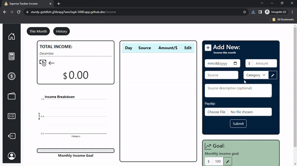
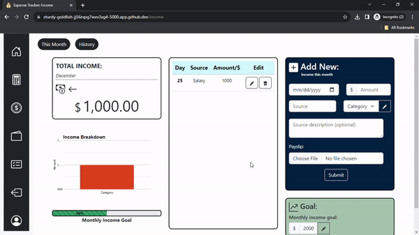
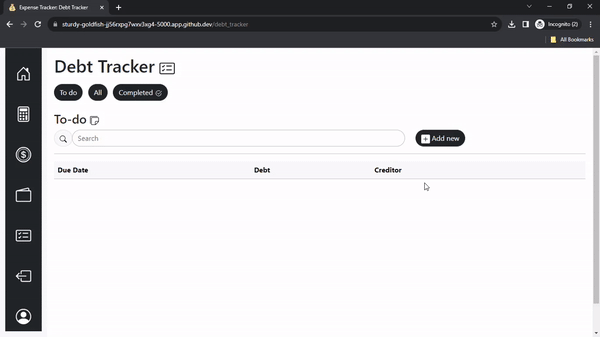
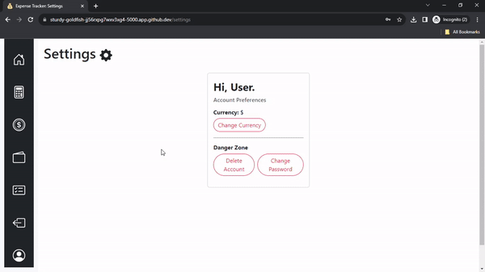

# Expense Tracker
#### Video Demo:  [<Demo>](https://www.youtube.com/watch?v=x-waIk9i8D8)
### Description
***
My final CS50x project is a web-based application that enables the user to organize their finances and visualize them through a user-friendly dashboard. The user is first validated before registering, and then they have the ability to add, edit, and delete expenses and income each month. This data is used to create charts, tables, and also to make calculations. There is a debt tracker functionality that helps the user prioritize and keep track of their debts.

### Database
***
All the data is stored in expense_tracker.db, which has five tables (users, categories, income, expenses, and debt).

- The users table contains the id (primary key), username, password hash, income goal, budget, and currency (the default is $).
- The categories table contains category_id (primary key), user_id (foreign key), category name, and mode (whether it is income or expense).
- The income table contains income_id (primary key), user_id (foreign key), date, source, description, category, amount, payslip, and time.
- The expenses table contains expenses_id (primary key), user_id (foreign key), date, item, description, category, amount, receipt, and time.
- The debt table contains the following: debt_id (primary key), user_id (foreign key), date, creditor, info, debt, done (check if debt has paid off).

### Technologies
***
A list of technologies used within the project:
* Python
* HTML
* Javascript
* CSS
* mySQL
* Bootstrap

### Adding Input
***
When the user enters data into the form, it is parsed and entered into the respective tables in the database.

A file is added like this:

```python
    filename = None

    if "payslip" in request.files:
        file = request.files["payslip"]

        if file and allowed_file(file.filename):
            filename = secure_filename(file.filename)
            file.save(os.path.join(app.config["UPLOAD_FOLDER"], filename))
```

This saves the files in the filesystem in a folder called 'file_uploads'. These files can be retrieved by the user from the history.html page.


Adding new income:




### Altering Input
***
The user can edit and delete the inputs in a particular month.
When the user wants to edit any of the data they input, they are shown a pre-filled form that they can alter. This updates the database accordingly.
The user also has the ability to delete any of their inputs. This happens when they confirm their choice and it prompts a javascript function when clicked.

Editing:



### Debt Tracker
***



### Personalizing the user's account
***
The user has the opportunity to change currency, change password, delete account, update income goal and to update their budget.

Personalizing:



## Documentation
https://flask.palletsprojects.com/en/1.1.x/
https://docs.python.org/3.12/
https://developer.mozilla.org/en-US/docs/Web/JavaScript
https://jinja.palletsprojects.com/en/3.0.x/templates/
https://www.json.org/json-en.html
https://api.jquery.com/category/ajax/


## About CS50x
https://cs50.harvard.edu/x/2023/
